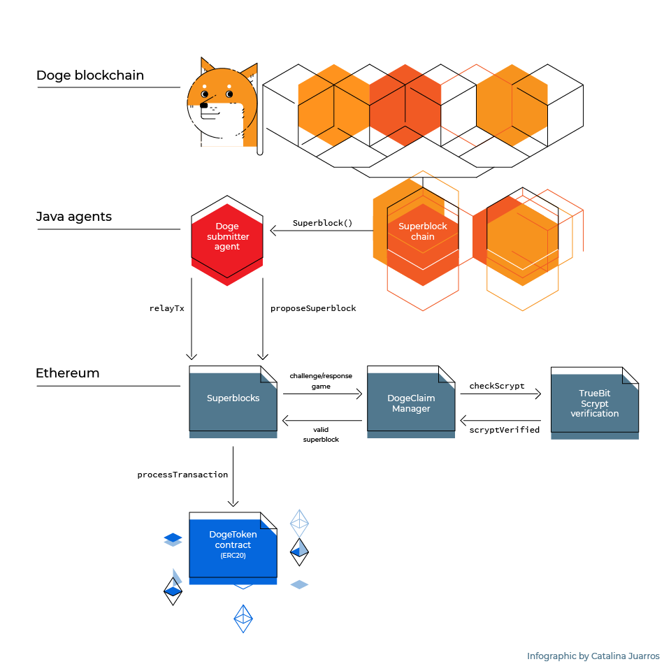
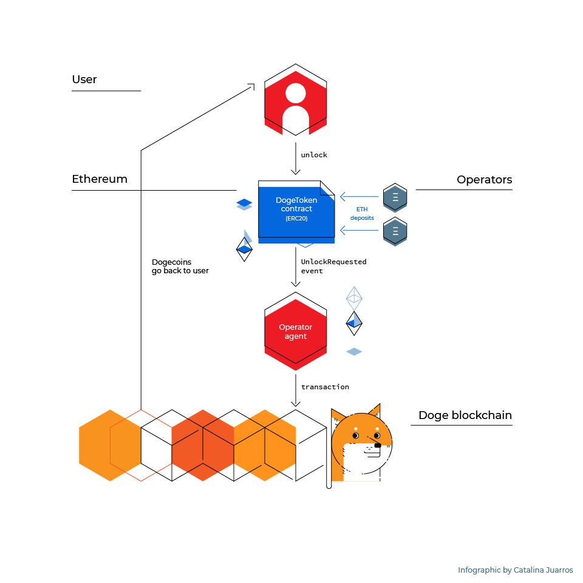

# Dogecoin <-> Ethereum bridge docs

The Dogecoin <-> Ethereum bridge is a system that allows Doges to be moved from the Dogecoin blockchain to the Ethereum blockchain and back.

## Main subprojects
* [Dogethereum contracts](https://github.com/dogethereum/dogethereum-contracts): Ethereum contracts.
* [Dogethereum agents](https://github.com/dogethereum/dogethereum-agents): External agents.
* [Dogethereum tools](https://github.com/dogethereum/dogethereum-tools): CLI tools for Users and operators.
* [Scrypt hash verification](https://github.com/dogethereum/scrypt-interactive): Interactive (i.e. challenge/response) validation of Scrypt hashes.

## Design

### Doge to Eth

### Eth to Doge

## Actors

This is the list of external actors to the system and what they can do.

* User
  * Lock (Doge -> Eth).
  * Transfer doge tokens (Eth -> Eth).
  * Unlock (Eth -> Doge).
* Operator
  * Register themselve as operator.
  * Add/Remove Eth collateral deposit.
  * Store locked doges.
  * Create, sign & broadcast doge unlock tx.
* Superblock Submitter
  * Propose superblocks.
  * Defend superblocks.
* Superblock Challenger
  * Challenge superblocks.
* Doge/Eth Price Oracle
  * Inform Doge/Eth price rate.

## Workflows
* New Superblock
  * There is a new block on the doge blockchain, then another one, then another one...
  * Once per hour Superblock Submitters create a new Superblock containing the newly created blocks and send a Superblock summary to [DogeClaimManager contract](https://github.com/dogethereum/dogethereum-contracts/contracts/DogeClaimManager.sol)
  * Superblock Challengers will challenge the superblock if they find it invalid. They will request the list of block hashes, the block headers, etc. Superblock Submitters should send that information which is validated onchain by the contact.
  * A Superblock Challenger might challenge one of the block's scrypt hashes. In that case [DogeClaimManager contract](https://github.com/dogethereum/dogethereum-contracts/contracts/DogeClaimManager.sol) uses Truebit's [Scrypt hash verification](https://github.com/dogethereum/scrypt-interactive) to check its correctness.
  * If any information provided by the Superblock Submitter is proven wrong or if it fails to answer, the Supperblock is discarded.
  * If no challenge to the Superblock was done after a contest period (or if the challenges failed) the superblock is considered to be "approved". [DogeClaimManager contract](https://github.com/dogethereum/dogethereum-contracts/contracts/DogeClaimManager.sol) contract notifies [DogeSuperblocks contract](https://github.com/dogethereum/dogethereum-contracts/contracts/DogeSuperblocks.sol) which adds the Superblock to its Superblock chain.
  * Note: [DogeSuperblocks contract](https://github.com/dogethereum/dogethereum-contracts/contracts/DogeSuperblocks.sol) uses a checkpoint instead of starting from dogecoin blockchain genesis.
 

* Sending dogecoins to ethereum
  * User selects an operator (any operator who has the desired amount of eth collateral).
  * User sends a lock doge tx of N doges to the doge network using [Dogethereum tools](https://github.com/dogethereum/dogethereum-tools) `lock` tool.
  * The doge tx is included in a doge block and several doge blocks are mined on top of it.
  * Once the doge block is included in an approved superblock, the lock tx is ready to be relayed to the eth network.
  * A [doge altruistic doge lock tx submitter](https://github.com/dogethereum/dogethereum-agents)  finds the doge lock tx (In the future there will be a tool for users to relay their own txs).
  * The [doge altruistic doge lock tx submitter](https://github.com/dogethereum/dogethereum-agents) sends an eth tx to [DogeSuperblocks contract](https://github.com/dogethereum/dogethereum-contracts/contracts/DogeSuperblocks.sol) containing: the doge lock tx, a partial merkle tree proving the doge lock tx was included in a doge block, the doge block header that contains the doge lock tx, another partial merkle tree proving the block was included in a superblock and the superblock id that contains the block.
  * [DogeSuperblocks contract](https://github.com/dogethereum/dogethereum-contracts/contracts/DogeSuperblocks.sol) checks the consistency of the supplied information and relays the doge lock tx to [DogeToken contract](https://github.com/dogethereum/dogethereum-contracts/contracts/token/DogeToken.sol).
  * [DogeToken contract](https://github.com/dogethereum/dogethereum-contracts/contracts/token/DogeToken.sol) checks the doge lock tx actually sends funds to the doge address of a registered operator.
  * [DogeToken contract](https://github.com/dogethereum/dogethereum-contracts/contracts/token/DogeToken.sol) mints N tokens and assigns them to the User. Dogecoin lock txs don't specify a destination eth address. Dogetokens will be assigned to the eth address controlled by the private key that signed the dogecoin lock tx.

* Sending doge tokens back to dogecoin
  * User selects an operator (any operator who has the desired amount of locked doges).
  * User sends an eth tx to the [DogeToken contract](https://github.com/dogethereum/dogethereum-contracts/contracts/token/DogeToken.sol) invoking the `doUnlock` function. Destination doge address, amount and operator id are supplied as parameters.
  * [DogeToken contract](https://github.com/dogethereum/dogethereum-contracts/contracts/token/DogeToken.sol) selects the UTXOs to spend, defines the doge tx fee, change and operator fee.
  * The [operator agent](https://github.com/dogethereum/dogethereum-agents) notices the unlock request. It creates, signs & broadcasts a doge unlock tx. 
  * The user receives the unlocked doges.
  * The operator waits the doge tx to be confirmed and included in a superblock and then relays the doge unlock tx to the eth network, so change can be used by [DogeToken contract](https://github.com/dogethereum/dogethereum-contracts/contracts/token/DogeToken.sol) for future unlocks.

## Incentives

Some operations require gas to be spent or eth deposit to be frozen. Here are the incentives for doing that.

* Submitting a Superblock: Superblock submitters will get a fee when the superblock they sent is used to relay a tx.
* Being an operator: Each time a lock/unlock tx is made, operator gets a fee.
* Sending dogecoin txs to DogeToken: Each user will send their own dogecoin lock tx to get doge tokens.
* Superblock challenge: Challengers who find invalid superblocks will get some eth after the challenge/response game finishes.

## Assumptions
* Incentives will guarantee that there is always at least one honest Superblock Submitter and one honest Superblock Challenger online.
* There are no huge regorgs (i.e. 100+ block) in Doge nor in Eth blockchains

## Team

* [Ismael Bejarano](https://github.com/ismaelbej)
* [Catalina Juarros](https://github.com/cat-j)
* [Pablo Yabo](https://github.com/pipaman)
* [Oscar Guindzberg](https://github.com/oscarguindzberg)

## License

MIT License 
Copyright (c) 2018 Coinfabrik & Oscar Guindzberg 
[License](LICENSE)
