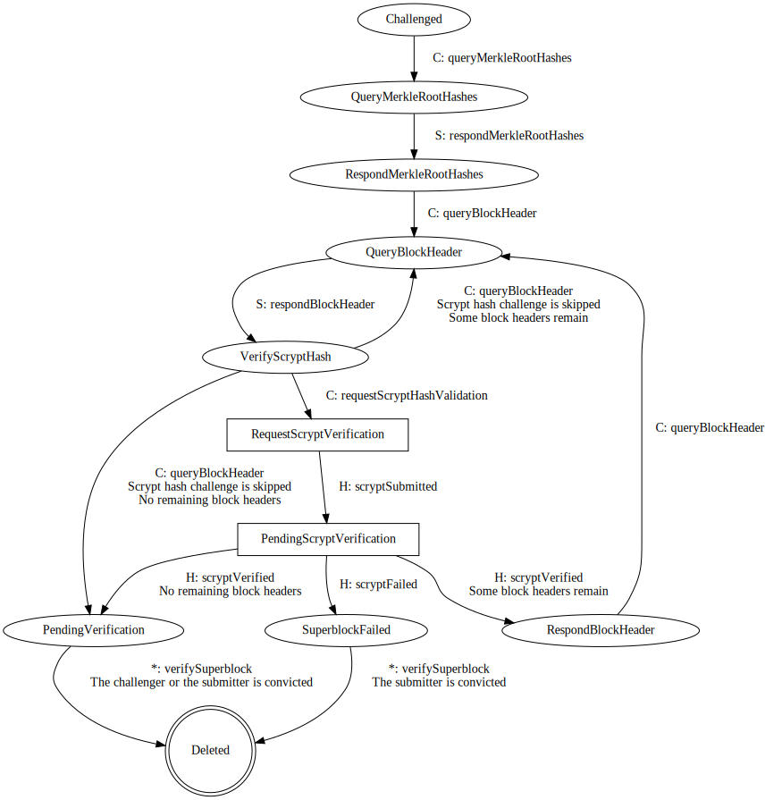

# Introduction

This is a short overview of the challenge-response protocol used to invalidate superblockchain claims.

### Notation

In some diagrams here we use the following notation:
We note `S: proposeSuperblock` as "the superblock submitter sends a transaction calling the `proposeSuperblock` function".

# Superblock claims

To propose a superblock, a submitter creates a claim about it. To do so, the submitter needs to make an ether deposit in the `SuperblockClaims` contract. Whenever this submitter proposes a superblock, part of his deposit is staked into the corresponding claim.

The claim can be challenged by anyone, provided they deposited enough ether into the contract.

The lifecycle of a claim can be visualized in the following diagram:

Actors:
- `S`: superblock submitter.
- `C`: claim challenger.
- `B`: `BattleManager` contract.
- `*`: anyone can send this transaction.

Here we consider `B` as an actor even though it is actually a contract. Normally, `B` is invoked by one of `S` or `C` but we don't distinguish them here.

A claim can be challenged any number of times but only one battle can occur at a time. See the [battle protocol](#battle-protocol) section to learn more about it.

# Battle protocol

In a battle there are only two participants: the superblock submitter and the challenger.

The protocol for a battle can be visualized in the following diagram:

Legend:

Actors:
- `S`: superblock submitter.
- `C`: claim challenger.
- `H`: `ScryptClaims` contract.
- `*`: anyone can send this transaction.

Once again, we consider `H` as an actor even though it is actually a contract. Normally, `H` is invoked by one of `S` or `C` but we don't distinguish them here.

Every transition here corresponds to a transaction sent successfully by either the submitter, the challenger, or, in some rare cases, anyone.

Whenever one party advances the battle, it stakes an additional amount of ether from their deposit. This amount is meant to eventually pay for the gas cost of the transaction sent in response by the opponent. If the deposit were to lack sufficient funds, the transaction is reverted and the battle is left unmodified.

Some nodes describe states where one of the parties can be timed out if they take too long to respond. In such cases, the opponent party wins by default.

# Scrypt claims

Scrypt hashes are verified through a claim system similar to the one used in superblocks.

Whenever a scrypt hash verification is necessary, the claim is submitted to a contract and any number of challengers may declare that they doubt the hash. What follows is a series of battles where the submitter and the challengers try to prove each other wrong. There are two possible outcomes:
- All challengers battle the submitter and fail to prove that the hash is invalid.
- One of the challengers proves that the hash is invalid.

## Scrypt hash battles

A scrypt hash battle is rather simple. The challenger must narrow incrementally the interval of steps of the hashing algorithm that contains an error. To do so, they ask for an intermediate state hash and based on the response of the submitter, they decide to discard the upper part of the interval or the lower part; akin to a binary search.

Eventually, the interval is narrowed down to one step. At this point, the submitter must submit the intermediate state and proof of the legitimacy of this state. These are checked by the contract and based on the results, either the submitter wins or the challenger wins.

At any point during a battle, one party may issue a timeout and win by default if the other party takes too long to respond.

## Claim resolution

When a claim has withstood against all challenges or failed to verify in a battle, the `DogeBattleManager` contract is notified.

<!-- TODO: Add ScryptClaims and ScryptVerifier diagrams -->
